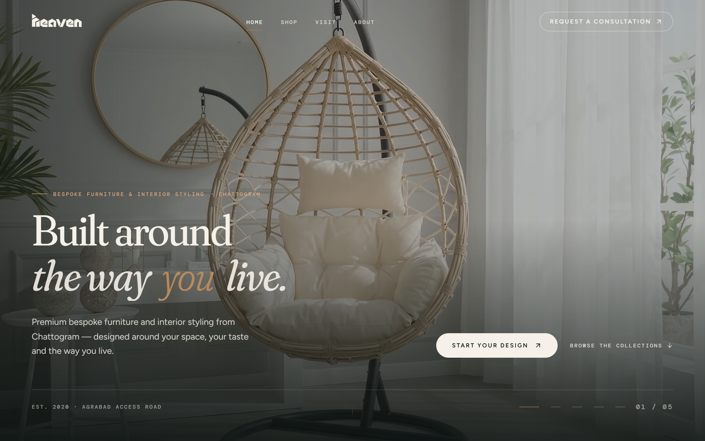
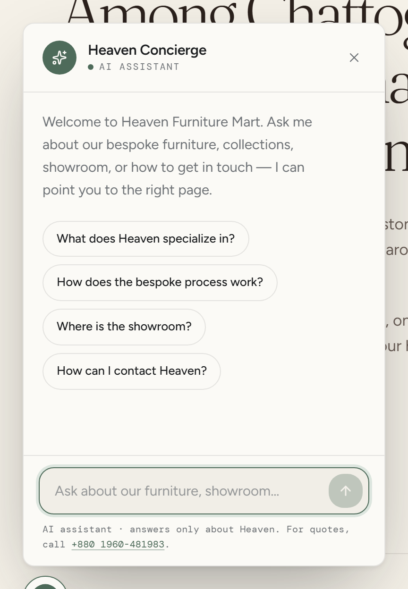
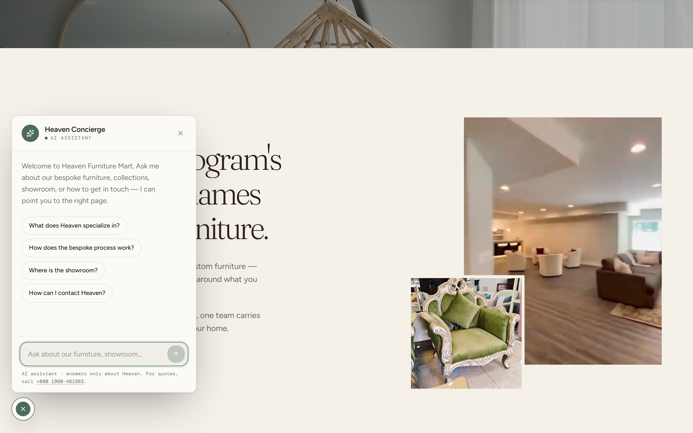
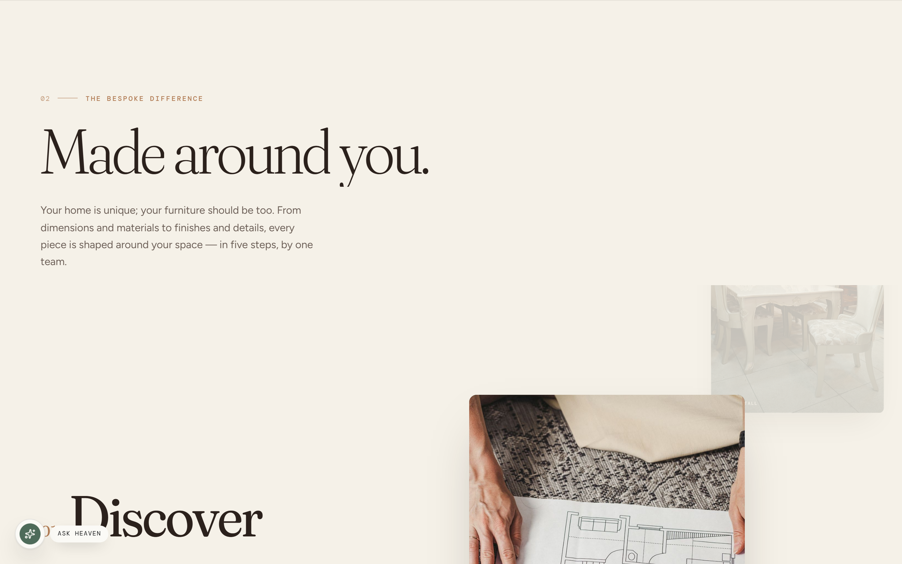
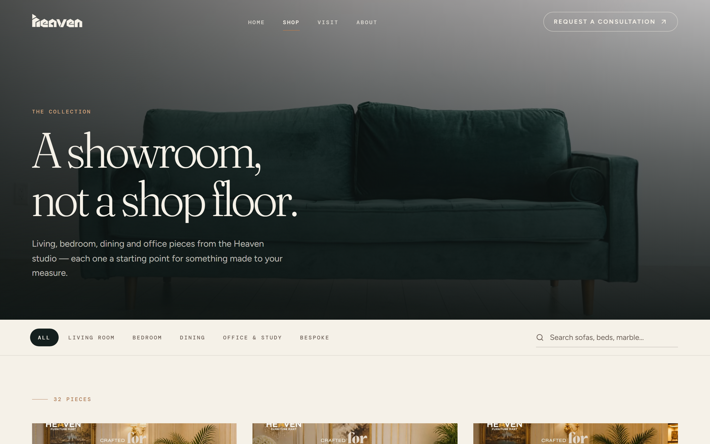
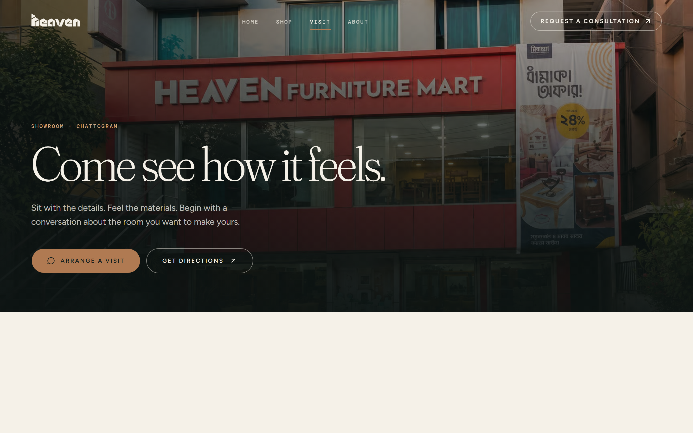

# Heaven Furniture Mart

<div align="center">


**Luxury Bespoke Furniture & Interior Styling Studio**  
*Agrabad Access Road, Chattogram, Bangladesh*

> *"Designed. Crafted. Customized."*

[](https://react.dev/)
[](https://www.typescriptlang.org/)
[](https://vitejs.dev/)
[](https://tailwindcss.com/)
[](https://motion.dev/)
[](https://lenis.darkroom.engineering/)
[](https://playwright.dev/)
[](https://oxc.rs/)

[Overview](#-project-overview) • [How to Run](#-how-to-run-the-project) • [AI Concierge Assistant](#-ai-concierge-assistant-spotlight) • [Features & Sections](#-features--sections-breakdown) • [Pages](#-pages--routes) • [Tech Stack](#-technical-architecture) • [Design System](#-design-system)

---

</div>



---

## 🌟 Project Overview

**Heaven Furniture Mart** is an editorial, high-conversion digital sanctuary for Chattogram’s premier bespoke furniture and interior styling studio. Founded in 2020 by Managing Director **Abul Kalam Bhuiyan**, Heaven creates furniture that is not mass-produced or picked off a generic showroom shelf—every piece is conceived around the client’s architecture, proportions, lifestyle, and aesthetic sensibilities.

This project delivers a digital experience that reflects that philosophy:

- **Bespoke-First Storytelling**: Elevates custom craftsmanship, material authenticity, and individual client consultation over conventional discount-heavy e-commerce.
- **Atmospheric Luxury Aesthetic**: Built with deep teal tones, warm ivory canvases, antique gold highlights, tactile photography, and fluid typography.
- **Intelligent AI Concierge**: An in-house virtual assistant grounded in studio knowledge that navigates the catalogue, explains the bespoke process, and guides showroom visits.
- **Kinetic Elegance**: Choreographed scroll reveals, interactive product quick-views, and silky smooth inertia scrolling powered by Lenis, Motion, and GSAP.

---

## 🚀 How to Run the Project

Follow these steps to run the application locally on your machine.

### Prerequisites

- **Node.js**: v18.0.0 or higher (v20+ recommended)
- **npm**: v9.0.0 or higher (or `pnpm` / `bun`)
- **Git** installed on your system

---

### Step 1: Clone the Repository

```bash
git clone https://github.com/saidulislamshehab/heaven-furniture-mart.git
cd heaven-furniture-mart
```

---

### Step 2: Install Dependencies

Install the project dependencies using npm:

```bash
npm install
```

---

### Step 3: Environment Configuration (Optional)

The application includes an AI Concierge that runs out-of-the-box with **zero required API keys** via its built-in keyless fallback provider (`LLM7`).

If you wish to configure your own LLM providers, copy the example environment file:

```bash
# Windows PowerShell
copy .env.example .env.local

# macOS / Linux
cp .env.example .env.local
```

Open `.env.local` to configure any of the supported providers:

```env
# 1) Any local or OpenAI-compatible server (e.g. freellmpool proxy, Ollama, vLLM)
LLM_BASE_URL=http://127.0.0.1:8787/v1
LLM_API_KEY=
LLM_MODEL=llm7/default,auto

# 2) OpenRouter Free Models (Recommended for production on Vercel)
OPENROUTER_API_KEY=your_openrouter_api_key
OPENROUTER_MODEL=nvidia/nemotron-3-super-120b-a12b:free,google/gemma-4-31b-it:free,openrouter/free

# 3) LLM7 Hosted Fallback (Keyless by default; optional key raises rate limits)
LLM7_API_KEY=
LLM7_MODEL=default,fast
```

> **Note**: All variables are server-side only. Do **not** prefix them with `VITE_` to ensure keys are never leaked to the client bundle.

---

### Step 4: Start the Local Development Server

Run the Vite development server:

```bash
npm run dev
```

- **Local URL**: `http://localhost:5173`
- **Full-Stack In Dev**: Vite is configured with custom SSR middleware (`heaven-dev-api`) in `vite.config.ts` that dynamically executes the serverless Vercel function (`api/chat.ts`) locally at `/api/chat`. No external proxy or `vercel dev` CLI is required!

---

### Step 5: Production Build & Preview

To generate the optimized production bundle:

```bash
npm run build
```

To preview the production build locally:

```bash
npm run preview
```

---

### Additional Scripts

| Command | Purpose |
| :--- | :--- |
| `npm run dev` | Starts Vite dev server with hot module replacement & dev API proxy |
| `npm run build` | Runs TypeScript compilation (`tsc -b`) and Vite production bundle |
| `npm run typecheck` | Type-checks the entire TypeScript codebase |
| `npm run lint` | Runs lightning-fast **Oxlint** code quality checks |
| `npm run validate` | Runs `lint` and `build` in sequence |
| `npm run test` | Executes end-to-end test suite with **Playwright** |
| `npm run test:ui` | Opens Playwright's interactive visual test runner |

---

## 🤖 AI Concierge Assistant (Spotlight)

<div align="center">



*The Heaven Concierge floating luxury widget with dynamic prompt starters, factual grounding, and instant routing.*

</div>

The **Heaven Concierge** is an intelligent showroom assistant embedded directly into the digital experience. It is designed to act as an attentive digital host for visitors exploring furniture collections, planning a bespoke home commission, or seeking showroom directions.

### Key Architecture & Capabilities

#### 1. Resilient 3-Tier Provider Fallback Chain
The backend endpoint (`api/chat.ts` and `api/_lib/assistant.ts`) implements an automated, cascading failover strategy:
1. **Local / Self-Hosted Server (`LLM_BASE_URL`)**: Connects to any OpenAI-compatible server or a local [`freellmpool`](https://github.com/0xzr/freellmpool) proxy pooling 20+ free LLMs.
2. **OpenRouter (`OPENROUTER_API_KEY`)**: Seamless failover to free top-tier models (NVIDIA Nemotron, Google Gemma 4, Mistral).
3. **LLM7 Hosted Fallback (`LLM7_API_KEY`)**: Keyless zero-configuration endpoint (`api.llm7.io`) that guarantees the assistant remains functional even without custom API keys.

#### 2. Strict Domain Knowledge Grounding
Unlike generic chatbots, the Heaven Concierge is anchored by a strict system prompt and verified knowledge base (`api/_lib/knowledge.ts`):
- **Zero Hallucinations**: Strict rules prohibit guessing prices, stock levels, or delivery lead times.
- **Accurate Brand Facts**: Speaks authoritatively about Heaven’s history since 2020, Managing Director Abul Kalam Bhuiyan, Agrabad Access Road showroom details, and workshop craftsmanship.
- **Polite Redirection**: Graciously deflects off-topic queries (coding, trivia, homework) back to furniture and interior styling.

#### 3. Intelligent In-Text Route Transformation (`RichText.tsx`)
The assistant's responses are parsed in real time into interactive elements:
- **Internal Routes**: Paths like `/shop?category=bedroom`, `/visit`, or `/#bespoke` automatically render as interactive navigation buttons that navigate without reloading.
- **Click-to-Call & Email**: Validates and links phone numbers (`tel:+8801960481983`) and emails (`mailto:heavenfurnituremart@gmail.com`).
- **External Geo & Chat**: Converts WhatsApp queries and Google Maps coordinates into direct links.

```
Visitor: "Where can I see your bedroom furniture?"
Concierge: "You can explore our curated pieces online at /shop?category=bedroom, or visit our physical showroom on Agrabad Access Road, Chattogram."
```

#### 4. Kinetic Gooey Shell & Micro-Interactions
- **Gooey Shell Morphing**: Built with SVG filter blend (`feGaussianBlur` + `feColorMatrix`) and Motion spring physics. The circular floating action trigger smoothly morphs into an expansive dialog card.
- **Scroll Awareness**: Hidden initially to preserve the hero section's minimalism; gracefully animates in after the user scrolls 60% of the viewport.
- **Full Keyboard Accessibility**: Supports `Esc` to close with focus restoration, `Enter` to submit, and accessible ARIA attributes (`role="dialog"`, `aria-live="polite"`).
- **Scroll Isolation (`data-lenis-prevent`)**: Ensures native smooth mouse wheel scrolling inside the chat log without hijacking page scroll.

<div align="center">



</div>

---

## 💎 Features & Sections Breakdown

The Heaven Furniture Mart platform is organized into cohesive, storytelling-driven sections:

### 1. Curtain Intro Loader (`IntroLoader.tsx`)
- Architectural brand title card with a converging split typography sequence: `HEA` from left and `VEN` from right meet at center, followed by `FURNITURE MART`.
- The warm ivory curtain then lifts like a theater reveal to present the hero section without frame drops.

### 2. Pinned Video Hero Section (`HeroSection.tsx`)
- Sticky pinned viewport architecture (`h-[100svh]`) that stays grounded as subsequent content slides over it.
- Ambient video loop showcasing artisanal furniture details, gold leafing, and showroom settings.
- Staggered headline reveal: *"Built around the way you live."*
- Primary CTA buttons: **"Start Your Design"** (triggers consultation dialog) and **"Browse The Collections"** (smooth scroll anchor).

### 3. Brand Manifesto & Intro (`IntroSection.tsx`)
- Typographic editorial statement: *"Furniture designed around the customer."*
- Establishes the core distinction between mass manufacturing and individualized interior styling.

### 4. The Bespoke Journey (`BespokeSection.tsx`)



- Interactive 5-stage customer journey:
  1. **Your Vision**: Understanding room dimensions, family lifestyle, and interior aesthetics.
  2. **Design Consultation**: One-on-one session with Heaven’s interior and furniture designers.
  3. **Custom Design**: Material, fabric, and dimensional drafting.
  4. **Skilled Craftsmanship**: Handcrafted production in Heaven’s Chattogram workshop.
  5. **Delivery & Installation**: White-glove placement and fitting by the workshop team.

### 5. Curated Collections (`CollectionsSection.tsx` & `ShopPage.tsx`)



- Showcases Heaven's signature categories:
  - **Living Room**: Modular sofas, accent egg chairs, carved coffee tables, TV consoles.
  - **Bedroom**: Solid wood beds, bespoke wardrobes, dressing tables, bedside suites.
  - **Dining**: Marble & hardwood dining tables, sculpted chairs, display cabinets.
  - **Office & Study**: Executive desks, library shelving, ergonomic workstation units.
- Interactive category filtering, debounced search, and **Product Quick View** dialogs with high-res photography and specifications.

### 6. In-House Craft & Materiality (`CraftSection.tsx`)
- Visual spotlight on premium timbers (Burma Teak, Mahogany, Oak), CNC precision cut joinery, hand carving, and hand-rubbed wax & lacquer finishes.

### 7. Why Heaven — Trust Pillars (`WhyHeavenSection.tsx`)
- Six core trust signals presented in an editorial grid:
  - Free design consultation
  - 100% bespoke customization
  - Premium sustainable timber & materials
  - Dedicated showroom on Agrabad Access Road
  - White-glove delivery & professional assembly
  - Transparent pricing & flexible payment terms

### 8. Founder's Philosophy (`FounderSection.tsx`)
- Profile of Managing Director **Abul Kalam Bhuiyan**.
- Personal philosophy on how furniture shapes memory, domestic comfort, and lasting architectural beauty in Bangladeshi homes.

### 9. Historical Milestones (`MilestonesSection.tsx`)
- Interactive chronology of Heaven’s growth:
  - **2020**: Founded in Chattogram with a focus on custom craft.
  - **2021**: Grand opening of the Agrabad Access Road showroom.
  - **2024–2025**: Featured exhibitor at the International Furniture Fair, Chattogram.
  - **2025**: Inducted as a member of the Chamber of Commerce.
  - **2026**: Launch of the digital luxury platform and AI Concierge.

### 10. Social Proof & Verified Reviews (`ProofSection.tsx`)
- **4.8 / 5.0 Google Rating** backed by verified Google reviews from satisfied homeowners across Chattogram and Dhaka.

### 11. Physical Showroom & Visit Teaser (`VisitTeaserSection.tsx` & `VisitPage.tsx`)



- Highlighting the physical studio experience on Agrabad Access Road.
- Interactive Google Maps embed with 1-click directions.
- Visit preparation guide (measurements to bring, fabric swatches to inspect).

### 12. Consultation Booking Modal (`ConsultationDialog.tsx`)
- Seamless pop-up dialog accessible from navigation and section CTAs.
- Captures visitor name, phone number, room category, and project notes.
- Generates a pre-formatted **WhatsApp consultation message** for instant direct communication with the design team.

---

## 🗺 Pages & Routes

| Route | Page | Purpose |
| :--- | :--- | :--- |
| `/` | `HomePage.tsx` | Pinned hero, bespoke story, collections preview, trust signals, milestones |
| `/shop` | `ShopPage.tsx` | Full 32+ item catalogue with live search, category tabs, and quick-view modals |
| `/about` | `AboutPage.tsx` | Detailed company narrative, founder profile, craft values, workshop films |
| `/visit` | `VisitPage.tsx` | Showroom directions, interactive Google Maps, showroom photography, visit tips |
| `*` | `NotFoundPage.tsx` | Branded editorial 404 page guiding visitors back to the home sanctuary |

---

## 🛠 Technical Architecture

```
heaven-furniture-mart/
├── api/                           # Serverless backend functions (Vercel & Vite dev)
│   ├── _lib/
│   │   ├── assistant.ts           # LLM provider orchestration & fallback chain
│   │   └── knowledge.ts           # Grounded brand knowledge base & system prompts
│   ├── chat.ts                    # POST /api/chat endpoint
│   └── tsconfig.json              # Backend TypeScript configuration
├── public/                        # Static assets, fonts, icons, videos
│   ├── images/                    # Furniture, showroom, brand, and craft photography
│   └── videos/                    # Video reels and workshop motion loops
├── docs/                          # Project documentation & visual assets
│   ├── screenshots/               # High-res UI & AI assistant screenshots
│   ├── context.md                 # Brand brief & business background
│   └── design-system.md           # Tokens, spacing, and typography guide
├── src/
│   ├── assets/                    # Bundled SVGs and graphics
│   ├── components/
│   │   ├── assistant/             # AI Assistant widget & RichText renderer
│   │   │   ├── AssistantWidget.tsx# Floating gooey shell dialog
│   │   │   └── RichText.tsx       # Live URL/route/phone token parser
│   │   ├── common/                # Shared layout & UI primitives (PageHero, Reveal, etc.)
│   │   ├── layout/                # RootLayout, Navbar, Footer
│   │   ├── sections/              # Modular home page sections (Hero, Bespoke, Craft, etc.)
│   │   └── ui/                    # Base components (Button, Dialog, Input, etc.)
│   ├── data/                      # Structured catalog data, site metadata, assets
│   ├── lib/                       # Utilities, Lenis smooth scroll, meta hook
│   ├── pages/                     # Routed page components (Home, Shop, About, Visit)
│   ├── App.tsx                    # React Router configuration & provider wrappers
│   ├── index.css                  # Tailwind v4 theme, design tokens & custom keyframes
│   └── main.tsx                   # Client entry point
├── scripts/                       # Automation scripts (screenshot capture, poster generators)
├── e2e/                           # Playwright end-to-end test suites
├── vite.config.ts                 # Vite setup with dev-api middleware & chunking
└── package.json                   # Project scripts and dependencies
```

---

## 🎨 Design System

The brand's visual identity blends heritage craftsmanship with contemporary editorial aesthetics:

### Color Palette

| Token | Hex Value | Role |
| :--- | :--- | :--- |
| `--color-brand-teal-deep` | `#142525` | Primary background, hero canvas, deep atmospheric luxury |
| `--color-brand-teal` | `#1a3030` | Secondary dark background & surface elements |
| `--color-brand-ivory` | `#fbf8f2` | Primary editorial light background & soft typography |
| `--color-brand-ivory-deep`| `#f3ede2` | Neutral borders, card backdrops, subtle dividers |
| `--color-brand-brown` | `#231b15` | Dark editorial body text on light backgrounds |
| `--color-brand-gold` | `#d29a5c` | Warm metallic accents, eyebrow badges, active states |
| `--color-brand-gold-soft` | `#e4be8a` | Subtle gold hover glows and borders |

### Typography

- **Display Serif (`Fraunces Variable`)**: High-contrast, editorial serif with warm italic character used for monumental headlines and section titles.
- **Primary Sans (`Figtree Variable`)**: Highly legible, geometric humanist sans-serif used for body text, navigation, and input controls.
- **Mono (`DM Mono`)**: Technical, editorial monospace used for metadata badges, year stamps, and coordinate labels.

---

## 🚢 Deployment (Vercel)

This application is ready for zero-configuration deployment to [Vercel](https://vercel.com/):

1. Push your repository to GitHub.
2. Import the repository into your Vercel Dashboard.
3. In **Project Settings → Environment Variables**, optionally add:
   - `OPENROUTER_API_KEY`: Your OpenRouter API key for high-speed AI responses.
   - `SITE_URL`: `https://your-domain.com`
4. Deploy! Vercel will automatically build the client bundle and deploy `/api/chat` as a serverless edge-compatible function.

---

## 📞 Contact & Showroom Details

- **Studio**: Heaven Furniture Mart
- **Address**: Agrabad Access Road, Chattogram, Bangladesh
- **Phone / WhatsApp**: [+880 1960-481983](tel:+8801960481983)
- **Email**: [heavenfurnituremart@gmail.com](mailto:heavenfurnituremart@gmail.com)
- **Google Maps**: [View Showroom on Google Maps](https://maps.app.goo.gl/WVXYtxmapjVe5i7o6)
- **Social Media**:
  - [Facebook](https://www.facebook.com/HeavenFurnitureMart)
  - [Instagram](https://www.instagram.com/heaven_furniture_ltd)
  - [YouTube](https://www.youtube.com/@HeavenFurnitureMart)

---

<div align="center">

Crafted with passion in Chattogram, Bangladesh.  
© 2020–2026 Heaven Furniture Mart. All rights reserved.

</div>
